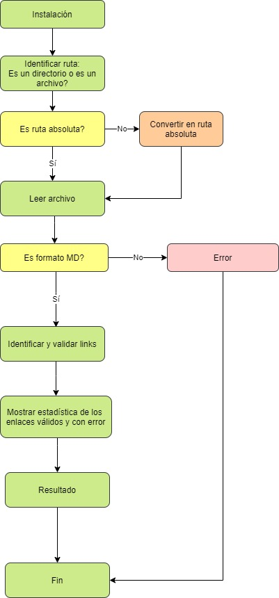
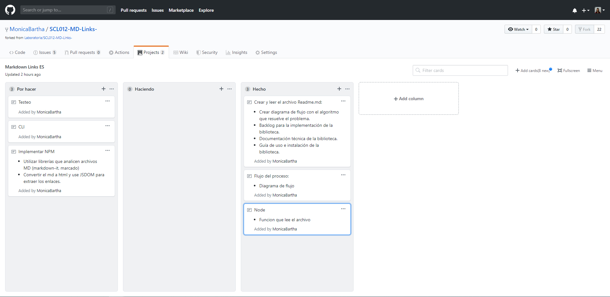

# Markdown Links

## Índice

* [1. Preámbulo](#1-preámbulo)
* [2. Instaliación](#2-diagrama-de-flujo)
* [3. Diagrama de flujo ](#3-instalación)
* [4. Uso](#4-uso)
* [5. Backlog](#7-backlog)
* [6. Autor](#8-autor)

***

## 1. Preámbulo

Markdown Links es un herramientaque lee y analiza archivos con extensión .md (Markdown), con el fin de verificar los links que contengan y reportar sus estadísticas de validación.

### Objetivo del proyecto
El objetivo del proyecto es realizar un programa que muestra tanto los enlaces válidos, como los enlaces con error. El programa funciona como una librería npm. El algoritmo realiza operaciones como: identificar ruta, convertirla en ruta absoluta, leer archivos, identificar y validar links. 

## 2. Diagrama de flujo
A traves de la diagrama de flujo se puede entender la lógica de la librería.

## 3. Instalación
Para instalar la librería se ejecuta el siguiente comando en la consola: 
`npm install monicabartha/md-links`

## 4. Uso

### Argumentos
* `path:` Ruta absoluta o relativa al archivo o directorio.
* `options:` Un objeto con las siguientes propiedades:
  * `validate:` Booleano que determina si se desea validar los links encontrados.

### Valor de retorno

La función retorna una promesa (Promise) que resuelva a un arreglo (Array) de objetos (Object), donde cada objeto representa un link y contiene las siguientes propiedades:

* `href:` URL encontrada.
* `text:` Texto que aparecía dentro del link (<a>).
* `file:` Ruta del archivo donde se encontró el link.

Deberás importar la librería en tu archivo .js:
`const mdLinks = require('@monicabartha/md-links');`

## 5. Backlog

Se creó un proyecto en GitHub para la organización y planificación del mismo, haciendo uso de milestones (por sprint), issues para asignar tareas por funciones y dentro de cada una un checklist con tareas más pequeñas. 

## 6. Autor
Proyecto realizado por [Monica Bartha](https://github.com/MonicaBartha)
